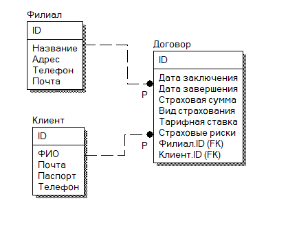
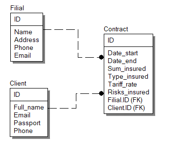

# Haulmont
### Development of the "Insurance Company" system using the [Jmix](https://www.jmix.ru/ "Платформа быстрой разработки веб приложений Jmix") framework.
### Содержание
 + [База данных](#Task)
 + [Стек](#Stack)
 + [Функционал](#Requirements)
 + [Примечание](#Note)
 
#####  База данных

#####  Стек
+ Java 11
+ Jmix 1.2.4
+ Jmix Studio
+ PostgreSQL

#####  Функционал
+ Приложение имеет локализацию на русском и английском языках.
+ Сущности Jmix имеют UUID, поддерживают оптимистическую блокировку, аудит создания и изменения, а также мягкое удаление.
+ БД наполняется содержимым, расположенным в логах изменений liquibase.

#####  Примечание
Документация:
  >[EN](https://docs.jmix.io/jmix/intro.html "Jmix Documentation")
  
  >[RU](https://docs.jmix.ru/jmix/intro.html "Документация Jmix")
